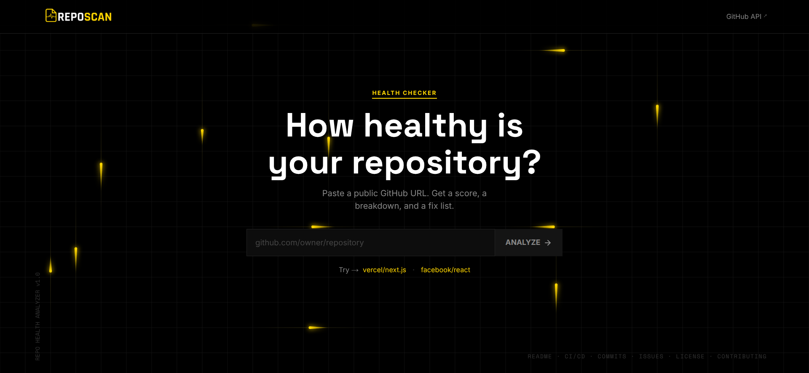
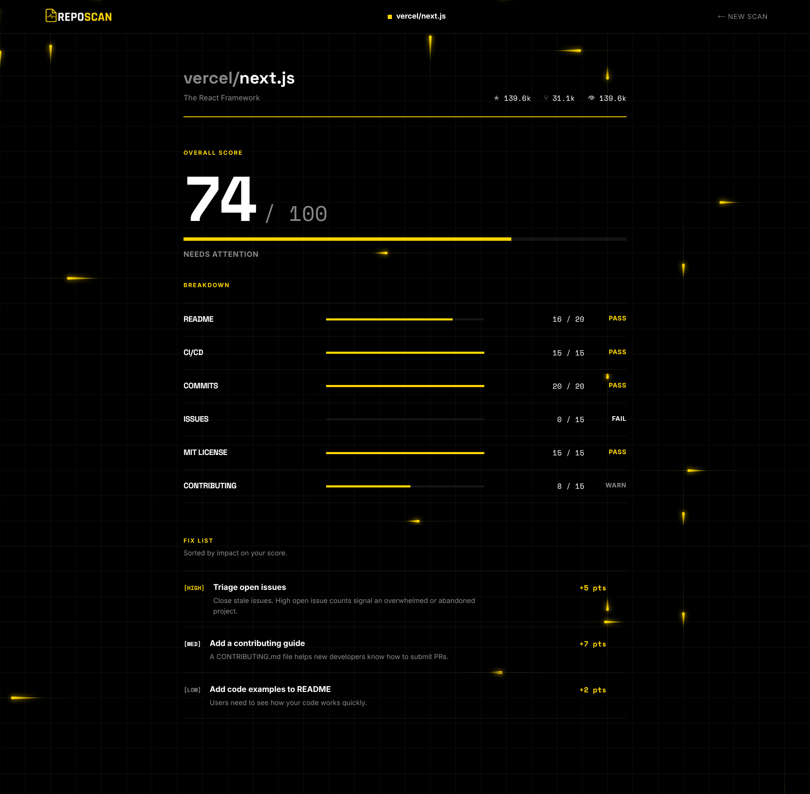

<p align="center">
  
</p>

<h1 align="center">RepoScan</h1>

<p align="center"><strong>A professional, high-performance repository health analyzer designed for deep technical audits. RepoScan evaluates public GitHub repositories on key maintenance, architectural, and community metrics to generate a comprehensive, actionable health score and prioritized fix list.</strong></p>

<p align="center">
  <em>This project was built as a technical submission for the Dev Weekends Fellowship 2026.</em>
</p>

---

## Previews





## Core Features

### Real-Time API Integration
Bypasses Next.js's aggressive internal caching using Next.js App Router API Route proxies configured with `cache: "no-store"` headers. This ensures that every health check reflects fresh, real-time repository metadata, commit histories, and issue reports.

### Debounced Autocomplete Search
Implements a high-efficiency autocomplete search using the GitHub Search API. A 400ms debounce ensures that repository suggestions update smoothly as the developer types, preventing redundant network requests and protecting API rate limits.

### Brutalist UI & Fluid Animations
Designed under a strict, hyper-minimalist brutalist aesthetic using pure black (`#000000`) and high-contrast yellow (`#FFD600`) tokens. The layout utilizes custom utility theme bindings via Tailwind CSS v4 and fluid view transitions managed through Framer Motion.

### High-Performance Canvas Background
Features an advanced "Data Stream / Cyber Comet" background animation running at 60fps on a native HTML5 Canvas. The particle simulation uses customized linear gradient vectors, tapered teardrop geometry, and localized path illumination to deliver premium technical graphics without CPU overhead.

### Resilient System Architecture
Formed around extremely robust parsing and exception handling. The input parser handles raw repository paths, full URLs, SSH tags, and `.git` suffixes seamlessly. Behind the scenes, the analysis engine handles API timeouts, missing metadata fields, and rate limit errors (403/429) gracefully, returning detailed diagnostic alerts instead of crashing.

## Tech Stack

* **Core Framework:** Next.js 15+ (App Router, Turbopack)
* **Language:** TypeScript (Strict Mode)
* **Styling & Theme:** Tailwind CSS v4 (configured via global CSS `@theme` declarations)
* **Animation & Rendering:** Framer Motion & Native HTML5 Canvas API

## Local Setup & Installation

Follow these steps to run the application locally on your machine:

### 1. Clone and Navigate
Clone this repository to your local workspace and navigate into the project root:
```bash
git clone https://github.com/hashirsajid58200p/reposcan.git
cd reposcan
```

### 2. Install Dependencies
Install the required packages using npm:
```bash
npm install
```

### 3. Environment Variables
Create a file named `.env.local` in the project root directory:
```bash
touch .env.local
```

Open `.env.local` and add your GitHub Personal Access Token (PAT):
```env
GITHUB_TOKEN=your_github_personal_access_token_here
```

> [!IMPORTANT]
> A valid `GITHUB_TOKEN` is strictly required to run scans. Because RepoScan executes 9 parallel requests per scan via `Promise.allSettled` to assess various repository metrics, unauthenticated requests will immediately hit GitHub's strict 60 requests/hour IP rate limit. Providing a PAT increases this limit to 5,000 requests/hour.

### 4. Run Development Server
Start the Next.js local development server:
```bash
npm run dev
```

### 5. Access the Application
Open your browser and navigate to the local server address:
```
http://localhost:3000
```
